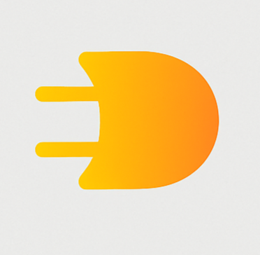
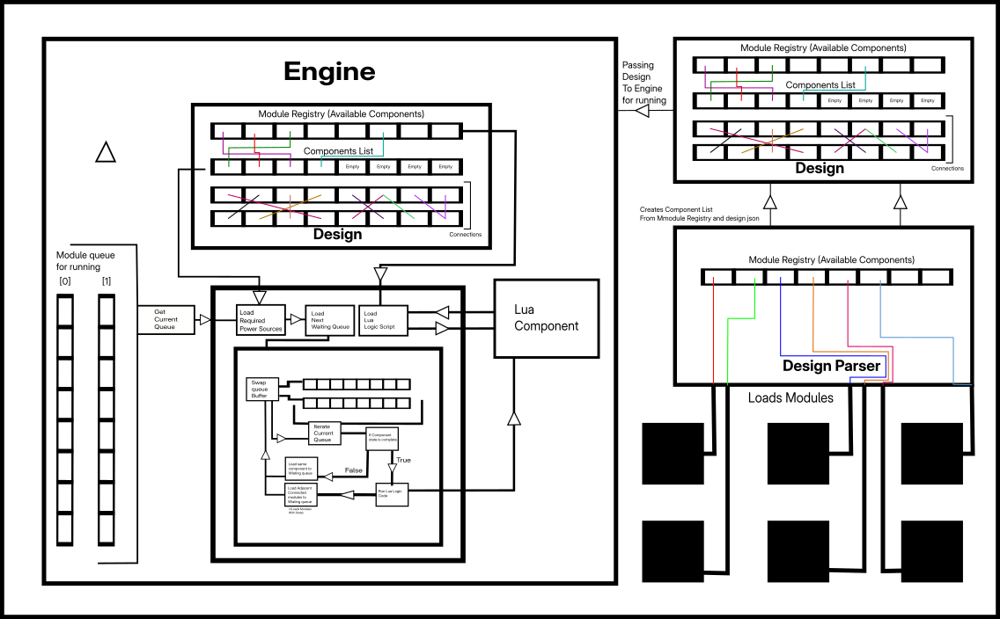

    

# LSengine
LSengine is a electronic circuit simulator engine

---------------------------
Demo For Running Test Files
---------------------------

for debug tests:-
python3 run.py Test/(testFileName) -debug

if it gives error 
try doing
 chmod +777 run.sh
and try again

---------------------------
How Engine works
---------------------------

    

